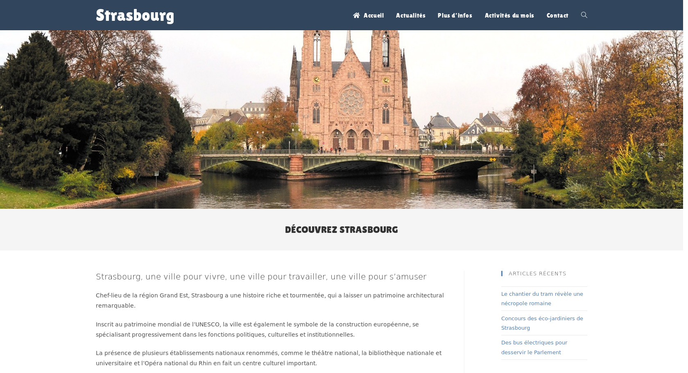

# Strasbourg
## Openclassrooms project | Customize a WordPress theme



I developed this site as part of my training as a web developer on [OpenClassrooms](https://openclassrooms.com).

This is a fictitious showcase site for the city of Strasbourg.

To view this site : [Strasbourg](http://strasbourg.oc.codbear.com)

## Setup Informations
### Requirements

+ PHP 7.3
+ composer
+ MariaDB/MySQL

### Installation

```bash
git clone https://github.com/codbear/strasbourg.git
cd strasbourg
composer install
chmod -R 775 *
```

Then you need to import the database

### Configuration
#### For development environment

```bash
cp local-config-sample.php local-config.php
nano local-config.php
```
And set your DB credentials.

#### For production environment

```bash
cp production-config-sample.php production-config.php
nano production-config.php
```
And set your DB credentials.
